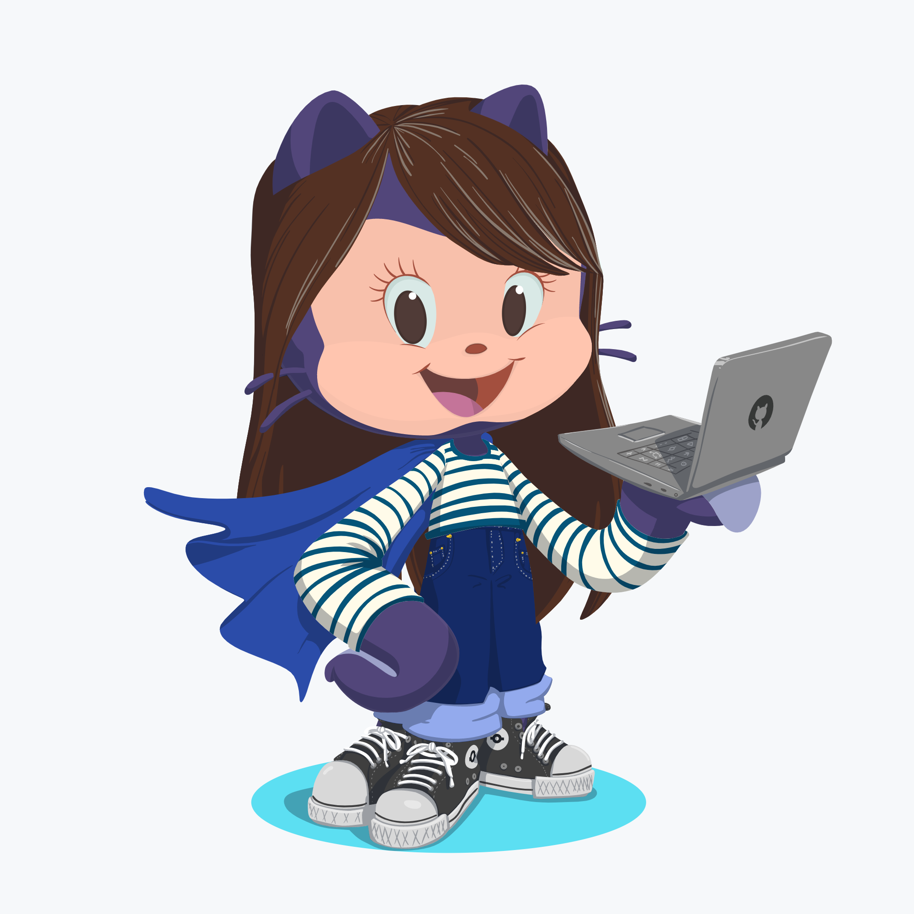

<h1 align="center">Hi, I'm Irla Andrade 👋👩‍💻</h1>

<h3 align="center">Uma administradora que encontrou nos códigos a sua paixão</h3>

- 🎓 Estudante de Sistemas para internet na FICR
  
- 💻 Apaixonada por tecnologia
  
- 👩‍💻 Estudando para me tornar uma desenvolvedora fullstack
  
- 📚 Desenvolvendo conhecimentos em JavaScript, Java, Node.js e React
  
- 🥰 Cachorros, jogos, livros e séries

 &nbsp;
 &nbsp;
 &nbsp;
 &nbsp;
 &nbsp;
 &nbsp;
 &nbsp;
 &nbsp;
 &nbsp;
 &nbsp;
 &nbsp;
 &nbsp;
 &nbsp;
 &nbsp;

---

